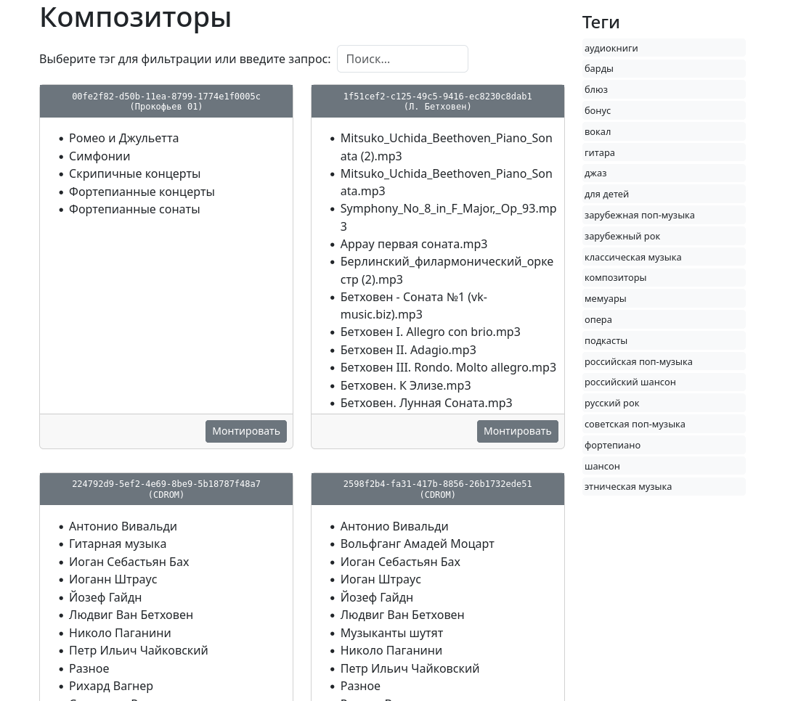

# 💿 Сервер для управления iso-образами 💿

Мы живём во времена, когда хранение файлов дома перестало, казалось бы, быть актуальным. Любой фильм или музыкальное произведение можно не только быстро найти в Сети, но и сразу же посмотреть или прослушать на стриминговых сервисах, не дожидаясь скачивания на свой компьютер, а семейный фотоальбом или бэкап базы данных удобно хранить в облаке. Однако в последнее время пользователей Рунета стали терзать смутные сомнения: а не проснутся ли они завтра в забытом уже режиме оффлайн? Как-то по-новому, в наши дни звучит правило: «Программисты делятся на тех, кто уже делает резервные копии, и кто ещё нет»…

Учитывая советский опыт, когда дефицитом за считанные часы могло стать что угодно, в один прекрасный день я пришел к выводу о том, что всё файловое хозяйство следует архивировать на DVD и хранить где-нибудь в «сухом прохладном месте». Не пожалев времени, я записал на болванки всё, что накопилось за годы компьютерной деятельности. Это  добавило спокойствия, но возникла чисто техническая проблема: если дисков слишком много, ими становится трудно управлять. Ведь при записи, чтобы экономить болванки, нужно набрать файлов на 4,5 Гб, поэтому тематически кпорядочить их не всегда получается. Можно бесконечно тщательно раскладывать резервные копии по коробочкам и  оснащать ярлычками, но когда их накапливается хотя бы несколько десятков, найти что-то нужное становится уже трудно. 

Решить проблему помогает то обстоятельство, что когда данные записываются на DVD, создаётся промежуточный iso-образ, с которого прожигается болванка. Управлять такими образами гораздо удобнее, чем вставляя реальные диски в привод: примонтировал и наботай как с обычной файловой системой. Поэтому я iso-образы не удаляю и, если нужно что-то восстановить из резервной копии, прежде всего ищу данные среди них.  Правда, монтирование тоже хочется как-то автоматизировать. Не вбивать же длинные и не всегда предсказуемые имена файлов вручную, поэтому я решил написать систему управления такими ресурсами.

Для автоматизации как нельзя лучше подошёл написанный давным-давно, но безупречно работающий и отлично масштабируемый веб-сервер [bashttpd](https://github.com/avleen/bashttpd). Доработав его под свои нужды, я добавил современный веб-интерфейс с возможностью поиска по контенту и по тэгам. Он лежит на отдельной ветке `frontend`, написан на фреймворке `svelte`. 



У `bashttpd` есть недостаток: он хорошо выполняет скрипты, но современную статику, полученную при компиляции из проекта `svelte`, раздаёт с ошибками. Пришлось задействовать `nginx` с обратным прокси:

```
server {

    server_name mediacollection;
    listen 80;
    root /path/to/iso-mounter/build; 

    location ~ \.iso {
        proxy_pass http://127.0.0.1:9660;
    }
}
```

Для запуска сервиса используется стандартный файл для `systemd`:

```
Description=ISO mounter

[Service]
Type=simple
WorkingDirectory=/path/to/iso-mounter
Environment="PORT=9660"
ExecStart=socat TCP4-LISTEN:9660,reuseaddr,fork EXEC:./bashttpd

[Install]
WantedBy=multi-user.target
```

Порт используется символичный: 9660, понимающие люди оценят 🤓 .
